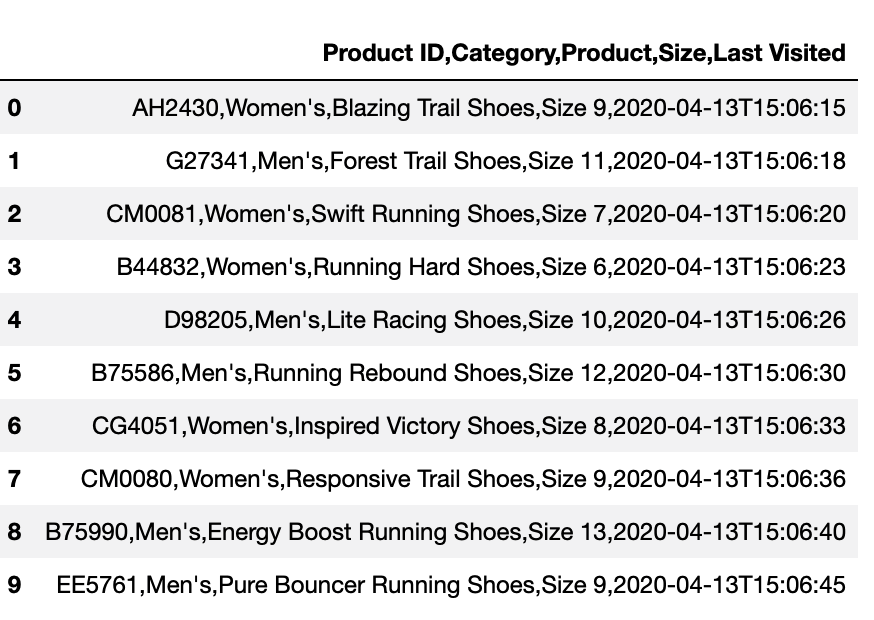
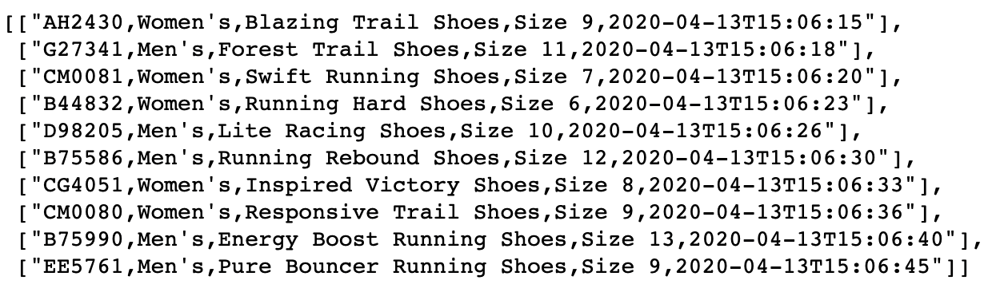
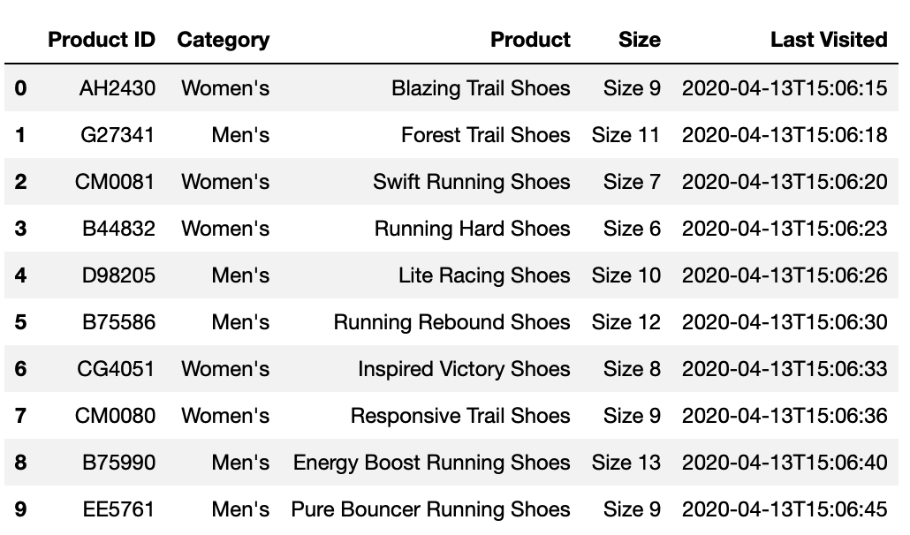
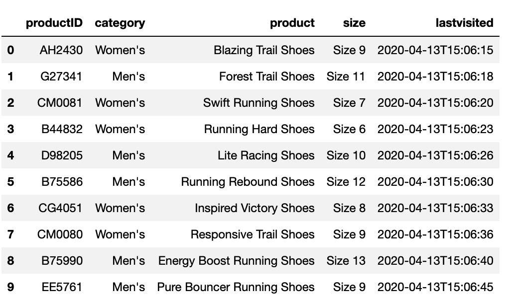
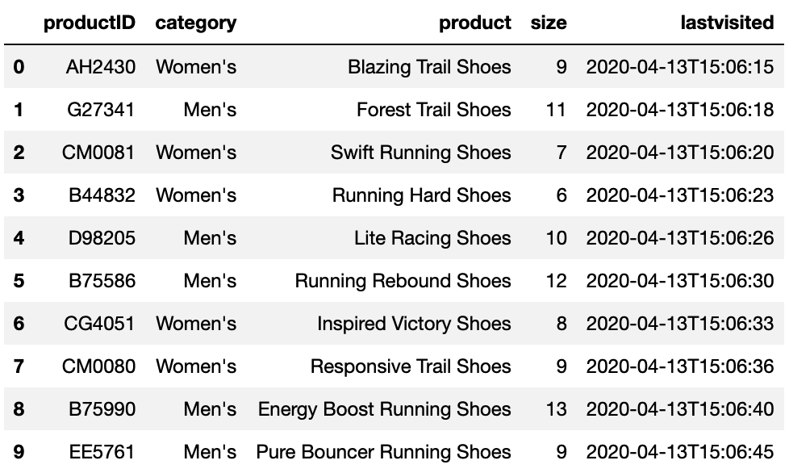

# Module 8 Class 1: Extract, Transform, and Load
 
## Overview

This module introduces the students to the Extract, Transform, and Load (ETL) process and teaches them how to move data through a pipeline. The students will use their skills and knowledge to create an entity relationship diagram, develop a database schema, and then load data into a postgreSQL database.
 
In today's class, the students will use Jupyter Notebook with Pandas to extract data and then transform and clean data by using Python methods and functions, list comprehensions, and regular expressions. 
 
## Learning Objectives
 
By the end of this class, the students will be able to:
 
* Extract data by using Python and Pandas. 
* Transform and clean data by using Python and Pandas.
* Parse string data into a Python dictionary.
* Use list comprehensions to make code more readable.
* Use regular expressions to manipulate string data.
 
- - -
 
## Instructor Notes
 
* The activities in this class will complement Lessons **8.1.1 Extract, Transform, Load** through **8.4.2: Writing Regular Expressions**. The students will benefit from the activities in this class if they‘ve progressed through the lessons that cover the following concepts, techniques, and tasks:
 
   * Overview of ETL
   * Creating a DataFrame from an Excel worksheet 
   * Overview of the iterative process of cleaning data
   * Using Pandas methods and functions 
   * List slicing, renaming columns, formatting and converting data types
   * Creating NumPy arrays
   * String concatenation
   * Parse and convert string data
   * List comprehensions
   * Pattern matching with regular expressions
 
## Slides
 
[ETL Class1 slideshow](https://docs.google.com/presentation/d/1uGF4ABUq9fHKdcaP0XH7njZZxk22aO3M99iJZlBZcxM/edit?usp=sharing)
 
## Student Resources
 
Share today's [activity resources](https://2u-data-curriculum-team.s3.amazonaws.com/data-viz-online-lesson-plans/08-Lessons-revised/8-1-Student_Resources.zip) from Canvas in case any students were unable to download them.
 
- - -
 
## Before Class
 
### 0. Office Hours
 
| Activity Time: 0:30       |  Elapsed Time:     -0:30  |
|---------------------------|---------------------------|
 
<details>
 <summary><strong> 📣 0.1 Instructor Do: Office Hours (30 minutes)</strong></summary>
  <br>
 
* Be sure to hold office hours prior to the start of class. Encourage the students to take full advantage of these designated times for asking questions and receiving assistance from instructional staff. You should expect the students to ask for assistance with tasks and topics such as:
 
 * Further review of a specific concept
 * Debugging code
 * Solving computer issues
 * Guidance with using a particular tool
 
</details>
 
- - -
 
## During Class
 
### 1. Getting Started
 
| Activity Time:       0:15 |  Elapsed Time:      0:15  |
|---------------------------|---------------------------|
 
<details>
 <summary><strong>📣 1.1 Instructor Do: Foundation Setting (10 minutes)</strong></summary>
 <br>
 
* Welcome the students to class.
 
* Direct the students to post individual questions in the Zoom chat. You and/or your TAs should answer these questions at the end of class.
 
* Use the slideshow to set the foundation for the material covered in this class.
 
* **Overview:** This is an opportunity for the students to observe where they are in the program. Take a moment to mention some real-world examples that show the value of this week's activities.
 
* **Program Pointers:** Congratulate the students on making it this far in the course. Stress that it’s important to stay focused as they move on to more advanced topics. 

* **ETL for This Week:** Tell the students that they should continue working on their ETL skills throughout the week, and remind them that they will use Python for most of the course.
 
* **This Week's Challenge:** Describe this week's Challenge. The students will perform the ETL process with the option to complete the first part of the Challenge using any of the following tools for data extraction:

  * Python and Pandas functions
  * List comprehension
  * Regular expressions 

* After the transformation step, they'll need to create a table schema in the database, and then load the data into the table. Finally, they'll perform data analysis using SQL on the crowdfunding database. 
 
* **Career Connection:** Let the students know that their new skills will be valuable throughout their careers. Provide examples of when you have used these skills in your workplace.
 
* **How to Succeed This Week:** Tell the students that they may have moments of frustration this week as they gain skills and work on complex problems. Use the slide material to outline some of the more difficult topics, and emphasize that finding and fixing errors builds stronger skills. Consider sharing something about your personal learning journey, including concepts or technologies that were difficult to grasp.
 
* **Today's Objectives:** Now, outline the topics for today's lesson. Remind the students that they can find the relevant activity files in the “Getting Ready for Class” page in their course content.
 
</details>
 
<details>
 <summary><strong>🎉  1.2 Everyone Do: Check-In (5 minutes)</strong></summary>
  <br>
 
* Ask the following questions and call on students for answers. A response for you to use, if appropriate, is included here.
 
   * **Question:** How are you feeling about your progress so far?
 
   * **Answer:** We are building your skillset, so it’s okay to sometimes feel overwhelmed. But don’t give up!  
 
   * **Question:** How comfortable do you feel with this topic?
 
   * **Answer:** To find out how comfortable everyone feels with the topic, let's do the following exercise: If you don’t feel confident at all, type 0 in the chat. If you feel very confident, type 5. If your confidence is between those levels, type the appropriate number between 0 and 5.
 
</details>
 
 
- - -
 
### 2. Data Transformation and Cleaning
 
| Activity Time:       0:40 |  Elapsed Time:      0:55  |
|---------------------------|---------------------------|
 
<details>
 <summary><strong>📣  2.1 Instructor Do: Data Transformation and Cleaning (15 minutes)</strong></summary>
  <br>
 
* In previous units, the students transformed and cleaned data to create tables and visualizations. In this demonstration, you will transform and clean a dataset to make it ready for loading into a database. 

* Open the slideshow for this activity and start the demo. 
 
* Open the `running_shoes.xlsx` file and show the students the data. 
 
   

* The following image shows the dataset after it has been transformed, cleaned, and imported into the database:
 
   
 
   * **Note:** The students will not create the table nor import data into postgreSQL in this activity.


* Open the [Data_Transformation_and_Cleaning.ipynb](Activities/01-Ins_Data_Transformation_and_Cleaning/Solved/Data_Transformation_and_Cleaning.ipynb) file, and then read the `running_shoes.csv` file into a DataFrame.
 
   ```python
   pd.set_option('max_colwidth', 200)
   orders_df = pd.read_excel("../Resources/running_shoes.xlsx")
   orders_df
   ```
 
   
 
* All the data is in one column, “Product ID,Category,Product,Size,Last Visited”.  
 
* We can transform the column name into a list of five elements by using the following code:  
 
   ```python
   import pandas as pd
   # Get the columns into a list.
   shoe_order_cols = orders_df.columns.tolist()
   shoe_order_cols
   ```
 
   * The output contains each column name with a comma separator.

   ```text
   ['Product ID,Category,Product,Size,Last Visited']
   ```
* Then, we use a `for` loop to iterate through the `shoe_order_cols` list, split the elements on the comma, and add each item to a list.
 
   ```python
   # Split the column name on the comma to create five elements. 
   new_columns = []
   for col in shoe_order_cols:
      new_columns.append(col.split(","))
   print(new_columns[0])
   ```
 
* Next, we'll apply the same transformation to the row values in the DataFrame. 
 
   * First, get each row into a list. 
 
      ```python
      # Get each row into a list.
      shoe_orders_values = orders_df.values.tolist()
      shoe_orders_values
      ```
      
      
 
   * Next, run the code to split the values of each row in the list on the comma and add the items to a new list. 
 
      ```python
      # Split the values of each row in the list on the comma and add the items to a new list.
      shoe_orders_list = []
      for item in shoe_orders_values:
         shoe_orders.append(item[0].split(","))
      shoe_orders_list
      ```
 
      
 
* Tell the students that we have two lists: the nested list for the columns and the nested list of row values that we will use to create a new DataFrame.
 
* Next, run the following code to create a new DataFrame.  
 
   ```python
   # Create a new DataFrame with the new column names and list of shoe orders
   shoe_orders_df = pd.DataFrame(shoe_orders_df_list, columns=new_columns[0])
   shoe_orders_df
   ```
 
   

* There is an alternative method of creating the `shoe_orders_df` DataFrame. Using the following code, we can split the row values in the “'Product ID,Category,Product,Size,Last Visited'” column into five columns on the delimiter, `','`. 

   ```python
   # Alternative method.
   shoe_orders_df = pd.DataFrame()
   shoe_orders_df[['Product ID', 'Category', 'Product', 'Size', 'Last Visited']] = orders_df['Product ID,Category,Product,Size,Last Visited'].str.split(',', n=5, expand=True)
   shoe_orders_df
   ```
 
* Now that we have transformed the data, we can clean the DataFrame. 
 
   * First, run the following code to rename the columns to match the table in the database. Point out that we also had the option to create the column names when we split the data into five columns.
 
      ```python
         # Rename the columns. 
         shoe_orders_df.rename(columns={'Product ID': "productID",
                                    'Category': "category",
                                    'Product': "product",
                                    'Size': "size",
                                    'Last Visited': "lastvisited"}, inplace=True)
         shoe_orders_df
      ```
 
      
 
   * Next, run the following code to remove the word "Size" and trailing whitespace from the "size" column, and then convert the "size" column to an `int64` data type. 
 
      ```python
      # Remove the word "Size" and trailing whitespace from the "size" column.
      shoe_orders_df["size"]  = shoe_orders_df["size"].str.replace("Size ","")
      # Convert the "size" column to an integer datatype
      shoe_orders_df["size"]  = pd.to_numeric(shoe_orders_df["size"])
      shoe_orders_df
      ```
 
      
 
   * Check the data types using the `info()` method. Or, use `shoe_orders_df.dtypes["size"]`.
 
   * **Note:** Tell students that they can also use `shoe_orders_df["size"] = shoe_orders_df["size"].astype('int')` to convert the "size" column data type to a `int64` data type. 
   
   * Next, run the following code to convert the "lastvisited" column to a `datetime` data type. 
   
      ```python
      # Convert the "lastvisited" column to a datetime datatype.
      shoe_orders_df["lastvisited"]  = pd.to_datetime(shoe_orders_df["lastvisited"])
      shoe_orders_df.info()
      ```
 
      
 
* Our final DataFrame has the same column names and data types as the table in the postgreSQL database. 
 
   
 
* Send out the [Data_Transformation_and_Cleaning.ipynb](Activities/01-Ins_Data_Transformation_and_Cleaning/Solved/Data_Transformation_and_Cleaning.ipynb) file for the students to use as a reference.
 
* Ask the class the following questions and call on the students for answers:
 
   * **Question:** How would we read the data if it was in a CSV file? 
 
   * **Answer”** We would use the `delimiter=","` or `sep=" "` as an argument when we read the data into a DataFrame. 
 
   * **Question:** What was the purpose of this activity? 
 
   * **Answer:** It provided practice with parsing a wide variety of formatted data.
 
   * **Question:** What can you do if we don't completely understand this activity?
   
   * **Answer:** Please contact the instructional staff (instructor and TAs).
 
* Answer any questions before moving on.
 
</details>
 
<details>
 <summary><strong>✏️ 2.2 Student Do: Transform and Clean Online Orders (15 minutes)</strong></summary>
<br>
 
* In this activity, the students will transform and clean a dataset that will later be uploaded into a database.
 
* Make sure the students can download and open the [instructions](Activities/02-Stu_Transform_and_Clean_Online_Orders/README.md), the [unsolved Transform and Clean Online Orders](Activities/02-Stu_Transform_and_Clean_Online_Orders/Unsolved/Transform_and_Clean_Online_Orders_Unsolved.ipynb) file, and the [online_orders.csv](Activities/02-Stu_Transform_and_Clean_Online_Orders/Unsolved/Resources/online_orders.csv) file from the AWS link. 
 
* Go over the instructions in the README, then open the [Transform and Clean Online Orders solution](Activities/02-Stu_Transform_and_Clean_Online_Orders/Solved/Transform_and_Clean_Online_Orders_Solved.ipynb) file within the Jupyter Notebook. Show students the final transformed and cleaned DataFrame.
 
    
 
* Place the students into groups of 3–5. Each group member should work on the solution by themselves, but they can reach out to others in their group for suggestions.
 
* Let the students know that they may be asked to share and go through their work at the end of the activity.
 
</details>
 
 
<details>
 <summary><strong> ⭐ 2.3 Review: Transform and Clean Online Orders (10 minutes)</strong></summary>
  <br>
 
* Ask for a volunteer to go through their solution. Remind the students that it's okay if they didn't finish the activity.
 
* To encourage participation, you can open the [starter code](Activities/02-Stu_Transform_and_Clean_Online_Orders/Unsolved/Transform_and_Clean_Online_Orders_Unsolved.ipynb) and ask the students to help you write the different conditional list comprehensions.
 
* If there are no volunteers, open up [Transform and Clean Online Orders solution](Activities/02-Stu_Transform_and_Clean_Online_Orders/Solved/Transform_and_Clean_Online_Orders_Solved.ipynb) in Jupyter Notebook, and then go through the code line by line while emphasizing the following points:
 
* First, we create a list for the column names using the `df.columns.to_list()`, or `list(df)`, then we split the column name on the comma, `','`, to create the new column names. 

     ```python
   # Create a list for the column names.
   columns = orders_df.columns.to_list()
   # Split the column on the comma and place names in a list.
   for column in columns:
      column_names = column.split(",")
   print(column_names)
   ```

* Next, we split the row values on the delimiter, `','` in the existing column and add the data to the six new columns. 
 
  ```python
   # Create a new DataFrame and split the data from one column into six columns.
   online_orders_df = pd.DataFrame()
   online_orders_df[['orderId', 'productName', 'category', 'sellingPrice', 'shipping', 'totalPrice']] = orders_df['orderId,productName,category,sellingPrice,shipping,totalPrice'].str.split(',', n=6, expand=True)
   online_orders_df
   ```

* Next, we convert the "sellingPrice" and "totalPrice" columns to a float data type using the `.astype(float)` method on each column. You can also apply the method to both columns at once using the following code:
 
   ```python
   online_orders_df[["sellingPrice","totalPrice"]] = online_orders_df[["sellingPrice","totalPrice"]].astype('float')
   ```  
 
* We calculate the "shippingPrice" column by subtracting the "sellingPrice" from the "totalPrice" with the following code:
 
   ```python
   online_orders_df["shippingPrice"] = online_orders_df["totalPrice"] - online_orders_df["sellingPrice"]
   ``` 
 
   * Point out that we must convert the "sellingPrice" and "totalPrice" columns to a `float` data type before we subtract the values in the columns. 

* Finally, we reorder the columns to get our transformed and clean DataFrame. 


   ```python
   # Reorder the columns.
   online_orders = online_orders_df[['orderId', 'productName', 'category', 'sellingPrice','shippingPrice', 'totalPrice', 'shipping']]
   ``` 

* Send out the [Transform and Clean Online Orders solution](Activities/02-Stu_Transform_and_Clean_Online_Orders/Solved/Transform_and_Clean_Online_Orders_Solved.ipynb) file for students to use as a reference.
 
* Answer any questions before moving on.
 

</details>
 
 
- - -
 
### 3. List Comprehensions
 
| Activity Time:       0:30 |  Elapsed Time:      1:25  |
|---------------------------|---------------------------|
 
<details>
 <summary><strong> 📣 3.1 Instructor Do: List Comprehensions (10 minutes)</strong></summary>
  <br>
 
* The students were introduced to list comprehensions in the asynchronous content. In this activity, the students will learn the structure of list comprehensions and how to use them more effectively. **Note:** You may use the slides to accompany this activity.
 
* List comprehension is the process of creating a new list in a single line of code.  
 
* Open [List_Comprehensions.ipynb](Activities/03-Ins_List_Comprehensions/Solved/List_Comprehensions.ipynb) in Jupyter Notebook. Remind the students that they have been using `for` loops to iterate through lists and other iterable objects like dictionaries and tuples. Now, they will learn about list comprehensions as another method for creating lists.
 
#### Comparing List Creation Methods by Using Python

Share the following code with the students: 
 
   ```python
   # Using a `for` loop to iterate through a list. 
   digits = []
   for x in range(10):
      digits.append(x)
   print(digits)
   ```
 
* Here is the basic syntax of a list comprehension: 
 
   * `[expression for element in iterable_object]`
 
* Every list comprehension in Python includes three elements:

   * The `expression`:
* A call  to a method, or any other valid expression that returns a value. 
   * The `element`:
* Is the object or value in the list or an iterable object. 
   * The `iterable_object`:
* Is a list, set, sequence, generator, or any other object that can return its elements one at a time.
 
* We can use the following code to convert the previous `for` loop into a list comprehension:
 
   ```python
   # Iterating through a list using list comprehensions.
   digits = [x for x in range(10)]
   print(digits)
   ```
   * The first `x` is the _expression_. 
   * The second `x` is the _element_.
    * `range(10)` is the <i>iterable_object</i>.
 
#### Using List Comprehensions for Mathematical Calculations
 
* Next, show the students how to perform mathematical calculations on a list using a `for` loop and then adding those values to a new list. 
 
   ```python
   # Create a list using a `for` loop that has a multiple of a number.
   squares = []
   for x in range(10):
      # raise x to the power of 2
      squares.append(x**2)
   print(squares)
   ```
 
* We can convert the previous `for` loop into a list comprehension: 
 
   ```python
   # Create a list using list comprehension that has a multiple of a number.
   squares = [x**2 for x in range(10)]
   print(squares))
   ```
 
#### Using Conditional Expressions with List Comprehensions
 
* Next, demonstrate how we can filter data based on a conditional expression by using list comprehensions. 
 
* Here's the syntax of a list comprehension with a conditional expression: 
 
   * `[expression for element in iterable_object if filter_expression]`
 
* For example, if we have a list of dogs with their name, age, and weight, and we want to see only the large dogs, we could use the following syntax:
 
   * `[dog for dog in dogs if dog['weight'] > 30]`
 
* In this list comprehension:

   * The first `dog` is the _expression_.
   * The second `dog` is the _element_.
   * `dogs` is the <i>iterable_object</i>.
   * `dog['weight'] > 30` is the <i>filter_expression</i>.
 
   * **Note:** We can use the _element_ in our filter expression.
  
* We can use a conditional in the filter expression to filter the list. For example, to create a list of even numbers, we can use the following code:
 
   ```python
   even_numbers = [x for x in range(50) if x % 2 == 0]
   print(even_numbers)
   ```
 
* We can also use a conditional in the expression. The following example prints numbers in lists of even and odd numbers:
 
   ```python
   numbers = ['Even' if x %2 == 0 else 'Odd' for x in range(20)]
   print(numbers)
   ```
 
* We can use list comprehensions to filter a list of dictionaries by accessing values inside the dictionaries.
 
   ```python
   candies_no_nuts = [candy for candy in candies if candy['has_nuts'] == False]
   print(candies_no_nuts)
   ```
 
* We can make it easier to read by selecting the name of the value in the dictionary.
 
   ```python
   candies_no_nuts = [candy['name'] for candy in candies if candy['has_nuts'] == False]
   print(candies_no_nuts)
   ```
 
#### Performing String Manipulation by Using List Comprehensions
 
* We can also use list comprehensions to filter and modify Python strings. 
 
* In the previous student activity, the column name was placed in a list. 
 
   * `['orderId,productName,category,sellingPrice,shipping,totalPrice']`
 
* We can use a list expression to split the column on the comma and place it in a new list with the following code:
 
   ```python
   # A list that holds the column name. 
   columns = ['orderId,productName,category,sellingPrice,shipping,totalPrice']
 
   # Split the column on the comma and place it in a list.
   column_names = [column.split(",") for column in columns]
   print(column_names[0])
   ```
 
* Show how we can identify numbers in a string using the `isdigit()` method:
 
   ```python
   #  User data entered as name and phone number
   user_data = "Elvis Presley 987-654-3210"
   phone_number = [ x for x in user_data if x.isdigit()]
   print(phone_number)
   ```
 
* Finally, demonstrate how we can perform data cleaning to remove the "$" sign from a string value and then convert the string to a `float` data type: 
 
   ```python
   # List of dollar amounts as string objects.
   totals = ["$94.00", "$68.00", "$122.95", "$128.00", "$96.00", "$119.90", "$93.90", "$113.60", "$89.75", "$106.85"]
 
   # Convert the dollar amounts to a float data type using list comprehensions.
   new_totals = [(float(total.replace('$',''))) for total in totals]
   print(new_totals)
   ```
 
* Send out [List_Comprehensions.ipynb](Activities/03-Ins_List_Comprehensions/Solved/List_Comprehensions.ipynb) file for the students to use as a reference.
 
* If you have enough time remaining, ask the following questions and call on students for answers.
 
   * **Question:** How can you get the data from a row in a DataFrame by using a list comprehension? 
 
   * **Answer:** We use `[row[0] for i, row in df.iterrows()]`.
 
   * **Question:** How did the previous activity help us prepare for the Challenge?
 
   * **Answer:** It doesn't directly help us with the Challenge, but it reinforces the steps and options for list comprehensions. 

* Answer any questions before moving on.
 
</details>
 
<details>
 <summary><strong> ✏️ 3.2 Students Do: List Comprehensions (15 minutes)</strong></summary>
  <br>
 
* In this activity, the students will practice using list comprehensions.
 
* Make sure the students can download the [instructions](Activities/04-Stu_List_Comprehensions/README.md) and the [starter code](Activities/04-Stu_List_Comprehensions/Unsolved/List_Comprehensions_Unsolved.ipynb).
 
* Go over the instructions with the students and answer any questions.
 
* Place the students into groups of 3–5. They should work on the solution by themselves, but they can reach out to others in their group for assistance.
 
* Let the students know that they may be asked to share and go through their work at the end of the activity.
 
</details>
 
<details>
 <summary><strong> ⭐ 3.3 Review: List Comprehensions (5 minutes)</strong></summary>
  <br>
 
* Ask for volunteers to go through their solution. Remind them that it is okay if they didn't finish the activity.
 
* To encourage participation, you can open the [starter code](Activities/04-Stu_List_Comprehensions/Unsolved/List_Comprehensions_Unsolved.ipynb) and ask the students to help you write the conditional list comprehensions.
 
* If there are no volunteers, open [List_Comprehensions_Solved.ipynb](Activities/04-Stu_List_Comprehensions/Solved/List_Comprehensions_Solved.ipynb) in Jupyter Notebook and go through the code line by line. Be sure to cover the following points.
 
   * `[x for x in range(100)]` would simply return the original list. Add in the conditional `x % 3 == 0` and explain how the conditional filters the list comprehension.
 
   * To make a list of numbers divisible by three or five, we can modify the previous list comprehension by adding an `or` operator followed by `x % 5 == 0`. 
 
   * In the pets example, we filtered the dictionary on the `type` key and returned the values from the `name` key. 
 
   * We use `.split(",")` on the expression to create a separate list for each customer that contains their customer ID, name, and email.  
 
      ```python
      [customer.split(",") for customer in customers]
      ```
 
   * To extract the customer ID from each customer, we can modify the previous list comprehension using list indexing to retrieve the first item in each customer list inside the `int()` constructor. 
 
      ```python
      [int(customer.split(",")[0]) for customer in customers]
      ```
 
   * To split each customer's "name" into a first and last name, we can modify the list comprehension by retrieving the second item in the list and then splitting that item on the whitespace, `(" ")`. 
 
      ```python
      [customer.split(",")[1].split(" ") for customer in customers]
      ```
 
* Send out the [List_Comprehensions_Solved.ipynb](Activities/04-Stu_List_Comprehensions/Solved/List_Comprehensions_Solved.ipynb) file for the students to use as a reference.
 
* Answer any questions before moving on.
 
</details>
 
 
- - -
 
### 4. Transforming and Cleaning Grocery Orders
 
| Activity Time:       0:15 |  Elapsed Time:      1:40  |
|---------------------------|---------------------------|
 
 
<details>
 <summary><strong>🎉 4.1 Everyone Do: Transforming and Cleaning Grocery Orders (15 minutes)</strong></summary>
  <br>
 
* In this activity, the students will read in the `grocery_orders.xlsx` dataset into a DataFrame, transform and clean the data to create a new DataFrame, and then merge the new DataFrame with the one created from the `grocery_suppliers.csv` dataset.
 
* Make sure the students can download and open the following files from the AWS link:
   * [instructions](Activities/05-Evr_Transform_and_Clean_Grocery_Orders/README.md)
   * [grocery_orders.xlsx](Activities/05-Evr_Transform_and_Clean_Grocery_Orders/Unsolved/Resources/grocery_orders.xlsx)
   * [grocery_suppliers.csv](Activities/05-Evr_Transform_and_Clean_Grocery_Orders/Unsolved/Resources/grocery_suppliers.csv)
   * [Transform_and_Clean_Grocery_Orders_Unsolved.ipynb](Activities/05-Evr_Transform_and_Clean_Grocery_Orders/Unsolved/Transform_and_Clean_Grocery_Orders_Unsolved.ipynb) 
 
* Review the instructions with the students, and then let them work for 10 minutes.
 
* When 10 minutes have elapsed, open the [unsolved Transform and Clean Grocery Orders](Activities/05-Evr_Transform_and_Clean_Grocery_Orders/Unsolved/Transform_and_Clean_Grocery_Orders_Unsolved.ipynb) file, read in the `grocery_orders.xlsx`, and ask for volunteers to go through their steps for creating the new grocery orders DataFrame.
 
* If there are no volunteers, open the [Transform_and_Clean_Grocery_Orders_Solved.ipynb solution](Activities/05-Evr_Transform_and_Clean_Grocery_Orders/Solved/Transform_and_Clean_Grocery_Orders_Solved.ipynb) file, and show how to create the new grocery orders DataFrame with the correct data types. Be sure to cover the following points.

   * After we read the data into a DataFrame, we create the new columns by adding the column name to a list and then splitting the list elements on the commas using a list comprehension.
 
      ```python
      grocery_orders_cols = grocery_orders_df.columns.to_list()
      new_columns = [col.split(",") for col in grocery_orders_cols]
      new_columns[0]
      ```
 
   * Next, we create a new DataFrame and split the data from one column into four columns. 
   
 
      ```python
      # Get each row into a list.
      grocery_df = pd.DataFrame()
      grocery_df[['upc12', 'item_name', 'cases_ordered', 'last_ordered']] = grocery_orders_df['upc12,item_name,cases_ordered,last_ordered'].str.split(',', n=4, expand=True)
      ```
   
   * To convert the "upc12" order numbers to integers, we remove the hashtag and convert the string values to integers.
 
      ```python
      # Convert the upc12 number to an integer.
      grocery_df["upc12"] = pd.to_numeric(grocery_df["upc12"].str.replace("#",""))
      ```

    * We use the `pd.to_numeric` function to convert the "cases_ordered" to an integer.
 
      ```python
      # Convert the number cases ordered to an integer.
      grocery_df["cases_ordered"] = pd.to_numeric(grocery_df["cases_ordered"])
      ```

   * Then, we convert the date from epoch or Unix format to datetime format.

      ```python
      # Convert the last_ordered column from UTC to a datetime format.
      from datetime import datetime as dt
      grocery_df["last_ordered"] = pd.to_datetime(grocery_df["last_ordered"], unit='s').dt.strftime('%Y-%m-%d') 
      ```
 
   * Next, we split each value in the "item_name" column into two values, with each value placed in the two new columns. We drop the "item_name" column and reorder the columns.
 
      ```python
      grocery_df[["category","name"]] = grocery_df["item_name"].str.split(' - ', n=1, expand=True)
      grocery_df_clean = grocery_df.drop("item_name", axis=1)
      grocery_df_clean = grocery_df_clean[['upc12','category', 'name', 'cases_ordered', 'last_ordered']]
      grocery_df_clean
      ```
 
   * Finally, we read in the `grocery_suppliers.csv` data into a DataFrame, check to make sure that the data types match in both DataFrames, and then merge the `grocery_df_clean` DataFrame with the `grocery_supplier` DataFrame using the following code:
 
      ```python
      grocery_database = grocery_df_clean.merge(grocery_supplier, on='upc12', how='right')
      grocery_database
      ```
   
      

* Send out the [Transform_and_Clean_Grocery_Orders_Solved.ipynb solution](Activities/05-Evr_Transform_and_Clean_Grocery_Orders/Solved/Transform_and_Clean_Grocery_Orders_Solved.ipynb) file for the students to use as a reference.

* Answer any questions before moving on.
 
</details>
 
 
- - -
 
### 5. Basic Regex Pattern Matching
 
| Activity Time:       0:15 |  Elapsed Time:      1:55  |
|---------------------------|---------------------------|
 
<details>
 <summary><strong> 📣 5.1 Instructor Do: Basic Regex Pattern Matching (15 minutes)</strong></summary>
  <br>
 
* In this course, we have used a variety of Python's string type methods for manipulating string data. Now we'll cover how to use Python's built-in regular expression (regex) module, a more robust tool for manipulating string data. 
 
* The goal of this demonstration is to show students how to find patterns in string data such as letters, words, numbers, or non-word characters using regular expressions instead of using Python's string type methods. **Note:** You may use the slides to accompany the activity. 
 
* Point out that we are going to use regular expressions to extract string data from the `grocery_orders.xlsx` file that we used in the previous activity. 
 
* Open [BasicRegex_PatternMatchingx.ipynb](Activities/06-Ins_BasicRegex_PatternMatching/Solved/BasicRegex_PatternMatching.ipynb) and go through the code with students.
   
* After we load the `grocery_orders.xlsx` file into a DataFrame, we place the column name in a list and store it in a variable:
 
   ```python
   grocery_orders_cols = grocery_orders_df.columns.to_list()
   grocery_orders_cols[0]
   ```
 
* Next, we import the `re` module, and then use the regular expression `split()` function to split the string data, `grocery_orders_cols[0]`, on the delimiter, `','`.
   
   ```python
   import re
   # Split the column on the comma.
   column_names = re.split(',', grocery_orders_cols[0])
   print(column_names)
   ```

* Run the next cell where the pattern has been substituted with `'\W'`. 
   
   ```python
   # Split the column on the comma using the character class, `\W`.
   colum_names = re.split('\W', grocery_orders_cols[0])
   print(colum_names)
   ```
   
   * The output from running the code is a list split on any non-word character. 
 
   ```text
   ['upc12', 'item_name', 'cases_ordered', 'last_ordered']
   ```
   
* The `'\W'` is a regular expression character class that will match any non-word character, like the comma, but not a letter, digit, or underscore. Regular expressions use backslashes in strings to denote special characters that would be difficult to enter directly. The backslash, `\`, before a character class is an *escape character* that tells the code to match the character class after the backslash. 

* If we want to split the string on the comma and underscore, we can use; `'\W|_'`, where the pipe, `"|"`, means "or".


   ```python
   # Split the column on the comma and underscore.
   column_names = re.split('\W|_', grocery_orders_cols[0])
   print(column_names)
   ```
 
* Next, we retrieve the values from the DataFrame and add them to a list. Then we use regular expressions to extract each value from the first row:
 
   ```python
   # Get each row into a list.
   grocery_orders_list = grocery_orders_df.values.tolist()

   # Split the values of the first row in the list on the non-word character.
   first_values = re.split('\W', grocery_orders_list[0][0])
   print(first_values)
   ```
   
* The output is a list where the row values from the first row are split on any non-word character, such as the hashtag and whitespace:
 
   ```text
   ['', '1576031803', 'Pasta', '', '', 'Fusilli', '5', '1622507126']
   ```
 
* Point out that using `\W` to split the values doesn't achieve what we want, which is splitting the list on the comma. It would be faster to use `split(",")`.  
 
* Answer any questions before moving on. 

#### Matching Digit Characters

* Next, we'll find all the numbers in the first row of values using the regular expression function, `findall()`. This function will find all matches of a pattern in a string and return the results in a list. The `findall()` function takes two parameters, a pattern and a string.

* First, we'll use the following regular expression `'[0-9]'` to get all the numeric characters. Run the following code. The output is every number in the first row of values.  
 
   ```python
   # Find all the numbers,
   numbers_only = re.findall('[0-9]', grocery_orders_list[0][0])
   print(numbers_only)
   ```

   ```text
   ['1', '5', '7', '6', '0', '3', '1', '8', '0', '3', '5', '1', '6', '2', '2', '5', '0', '7', '1', '2', '6']
   ```

   * Point out that the `[]` indicates a character class. Here, our function will find any numbers between zero and nine, the characters contained within the brackets.
 
* We can modify the pattern to find more than one digit, including all sequences of numbers, by adding a "+" after our regular expression. 
 
   ```python
   # Find one or more numbers together.
   numbers_only = re.findall('[0-9]+', grocery_orders_list[0][0])
   print(numbers_only)
   ```
 
   ```text
   ['1576031803', '5', '1622507126']
   ```
 
* And, we can find only the numbers that are a certain length by passing a number inside curly brackets, `{}` after our capture group. 
 
   ```python
   # Find the ten digit numbers.
   ten_digit_numbers = re.findall('[0-9]{10}', grocery_orders_list[0][0])
   print(ten_digit_numbers)
   ```
 
   ```text
   ['1576031803', '1622507126']
   ```

* Before moving on, tell the students that we can also use the `\d` character class for digits in place of `[0-9]`.

#### Matching Non-digit Characters

* In this next part, we'll use regular expressions to match "Pasta - Fusilli" in the first row of values. 

* Tell the students that we are building on the regex pattern for this match. 

* First, we will get all non-digit characters with one of the regex patterns, `'[^0-9]'`, `[^\d]`, or `\D`. 
 
   ```python
   # Find non-digit characters only.
   non_digit_only = re.findall('[^0-9]', grocery_orders_list[0][0])
   print(non_digit_only)
   ```
 
   ```text
   ['#', ',', 'P', 'a', 's', 't', 'a', ' ', '-', ' ', 'F', 'u', 's', 'i', 'l', 'l', 'i', ',', ',']
   ```

   * The caret, `^`, reverses the selection within the brackets. Here, this means we are _not_ going to match any digit characters for the pattern within the brackets.
 
* By adding a `+` after `'[^0-9]'`, or `\D`, we can find multiple one non-digit characters grouped together.
 
   ```python
   # Find more than one non-digit character.
   non_digit_only = re.findall('\D+', grocery_orders_list[0][0])
   print(non_digit_only)
   ```
 
   ```text
   ['#', ',Pasta - Fusilli,', ',']
   ```
 
* To avoid matching the hashtag, we can modify the regular expression by adding `[^#]` before our non-digit pattern, `'\D+'`, in the regular expression.
 
   ```python
   non_digital_only = re.findall('[^#]\D+', grocery_orders_list[0][0])
   print(non_digital_only)
   ```
 
   ```text
   ['3,Pasta - Fusilli,', '5,']
   ```

   * Although we avoided the hashtag, we captured single digit numbers and commas. 
   
* We can avoid the single digits and the hashtag by replacing the hashtag character in the previous code with the digit character, `\d`, inside the brackets.
  
   ```python
   non_digital_only = re.findall('[^\d]\D+', grocery_orders_list[0][0])
   print(non_digital_only)
   ```
 
   ```text
   [',Pasta - Fusilli,']
   ```
   
* Next, we add a comma after the digit character class inside the brackets to avoid capturing the comma before "Pasta".  

   ```python
   non_digital_only = re.findall('[^\d,]\D+', grocery_orders_list[0][0])
   print(non_digital_only)
   ```
 
   ```text
   ['Pasta - Fusilli,']
   ```
 
* Now, we add the same character class, `[^\d,]`, after the non-digit character class, `\D+`, to avoid capturing the comma after "Fusilli."  
 
   ```python
   non_digital_only = re.findall('[^\d,]\D+[^\d,]', grocery_orders_list[0][0])
   print(non_digital_only)
   ```

   ```text
   ['Pasta - Fusilli']
   ```

* Point out that we can use the following regular expression to achieve the same results:
`[^\d\W]\D+[^\d\W]` 
 
* Now that we have a regular expression to parse the data in the first row of values, we can test it on all the row values with a `for` loop or with list comprehension.

   ```python
   # A for loop.
   for item in grocery_orders_list:
      print(re.findall('[^\d,]\D+[^\d,]', item[0])[0])
   # A list comprehension
   [re.findall('[^\d,]\D+[^\d,]', item[0])[0] for item in grocery_orders_list]
   ```

   ```text
   Pasta - Fusilli
   Cheese - Cottage Cheese
   Beef - Sushi Flat Iron Steak
   Chicken - Ground
   Pasta - Penne Rigate
   Chicken - Wings
   Beef - Texas Style Burger
   Shrimp - Jumbo Gulf
   Cheese - Mozzarella
   Shrimp - Argentina Red
   ```

* Explain to the students that there are different character classes and punctuations that we can use within a regular expression to get the desired result. It all comes down to testing, reading the documentation, and researching to find what works.  

* Tell students that they'll continue to learn how to use regular expressions in the next class. 
 
* Send out the [BasicRegex_PatternMatchingx.ipynb](Activities/06-Ins_BasicRegex_PatternMatching/Solved/BasicRegex_PatternMatching.ipynb) file for students to use as a reference.
 
* Send out the [Python Regular Expression](https://docs.python.org/3/howto/regex.html) link for the students to reference. 
 
</details>

- - -
 
### 6. Ending Class
 
| Activity Time:       0:05 |  Elapsed Time:      2:00  |
|---------------------------|---------------------------|
 
<details>
 <summary><strong>📣  6.1 Instructor Do: Review (5 minutes) </strong></summary>
  <br>
 
* Review the skills that we covered today and the previous lessons that presented these concepts:

  * Extract, transform and clean data using Python and Pandas methods and functions is in **Lesson 8.3.3: Create the Category and Subcategory DataFrames** and **Lesson 8.3.4: Create the Campaign DataFrame**.

   * Converting data types in a DataFrame is in **Lesson 8.3.4: Create the Campaign DataFrame**.

   * Using list comprehensions is in **Lesson 8.3.4: Create the Campaign DataFrame** and **Lesson 8.3.5: Create the Contacts DataFrame**.

   * Using regular expression to transform data is in **Lesson 8.4.1: Introduction to Regular Expressions** and **Lesson 8.4.2: Write Regular Expressions**. 
 
* Finally, encourage the class to begin the Challenge as soon as possible. 

* If the students need help understanding documentation or activity instructions, they should send questions through the Learning Assistants channel or access their instructional team during pre-scheduled Office Hours. 

* Answer any questions before ending the class.
 
</details>
 
 
---
 
© 2022 Trilogy Education Services, a 2U, Inc. brand. All Rights Reserved.