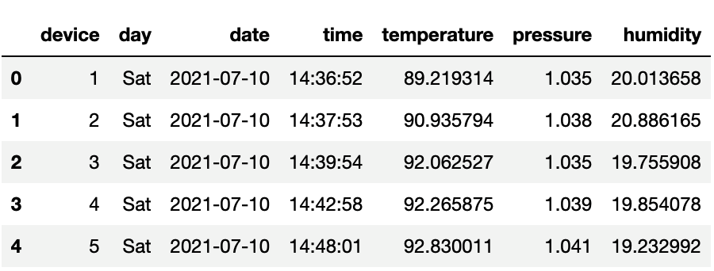

# Module 8 Class 2: Transformation and Cleaning by Using Regular Expressions

## Overview

In this class, students will learn how to write regular expressions to find patterns in Python string data. They will also use regular expressions to transform and clean data. During Office Hours, review this week’s Challenge assignment. 

## Learning Objectives

By the end of class, students will be able to:

* Use regular expressions to find patterns in string data.

* Use sets, wildcards, and escaping in regular expressions.

* Use special characters in regular expressions to find and extract string data. 

* Use regular expression capture groups to retrieve specific information from string data. 

* Transform and clean data using regular expressions. 

- - -

## Instructor Notes

* The activities in this class will complement Lessons **8.3.5 Create the Contacts DataFrame** through **8.4.3 Using Regular Expressions for Data Transformation**.  Students will benefit from this class if they‘ve progressed through these lessons that cover the following concepts, techniques, and tasks:

  * Converting a JSON string to a Python dictionary

  * Writing regular expressions

  * Matching and extracting string data using regular expressions

  * Data transformation and cleaning using regular expressions


## Slides

[ETL Class 2 slideshow](https://docs.google.com/presentation/d/1iCjydX7wKZlD7p9c6Wjx2fu9FtVpRNjLRiGjQd18erU/edit?usp=sharing)

## Student Resources

Share today’s [activity resources](https://2u-data-curriculum-team.s3.amazonaws.com/data-viz-online-lesson-plans/08-Lessons-revised/8-2-Student_Resources.zip) in case any students were unable to download them. 

- - -

## Before Class

### 0. Office Hours

| Activity Time: 0:30       |  Elapsed Time:     -0:30  |
|---------------------------|---------------------------|

<details>
 <summary><strong>📣 Instructor Do: Office Hours (30 minutes)</strong></summary>

* Explain to the students that the first part of Office Hours will be spent reviewing the Challenge requirements and rubric. 

* Open the Challenge in Canvas and go through the high-level instructions and requirements with the students. Ask the students if they have any questions.

* Scroll down to the rubric in Canvas, go through the Proficiency column, and show how it maps back to the requirements for each deliverable. Ask the students if they have any questions.

* Review the following guidance for this Challenge.

  * For **Deliverable 1: Extract the Data**, students will use their knowledge of Python, Pandas, and the extract and transform process of ETL. They'll extract raw data and add it to DataFrame for the transformation process.

  * Go over the [Module 8 ETL function solution](../../../01-Assignments/08-ETL/Challenge_Solution/Extract-Transform_solution.ipynb) and compare it to the [ETL Challenge starter code](../../../01-Assignments/08-ETL/Resources/Extract-Transform_starter_code.ipynb). Point out all the commented steps where the students will add code to complete the Challenge.

  * For **Deliverable 2: Transform and Clean the Data**, the students will use their knowledge of Python, Pandas, and data cleaning strategies. They’ll transform data by formatting, splitting, and restructuring it to create a DataFrame that can be loaded into a PostgreSQL database as a CSV file.

  * Go over the [Module 8 ETL function solution](../../../01-Assignments/08-ETL/Challenge_Solution/Extract-Transform_solution.ipynb) and compare it to the [ETL Challenge starter code](../../../01-Assignments/08-ETL/Resources/Extract-Transform_starter_code.ipynb). Point out all the commented steps where the students will add code to complete the Challenge.

  * For **Deliverable 3: Create an ERD and Table Schema, and the Load Data**, the students will use Quick DBD to create an ERD based on the new data from Deliverable 2. Next, they will export the table schema as a PostgreSQL file and then upload the data into the new table in the `crowdfunding_db` database on pgAdmin.

  * The students can earn bonus points for completing **Deliverable 4: Bonus–SQL Analysis**. In this deliverable, they will use their knowledge of SQL to perform data analysis on the `crowdfunding_db` database.

* Encourage the class to begin the Challenge as soon as possible. If the students need help understanding documentation or activity instructions, they should send questions through the Learning Assistants channel or access their instructional team during pre-scheduled Office Hours. 

* Answer any questions about the Challenge requirements before moving onto other questions the students may have.

* Encourage the students to take full advantage of Office Hours for asking questions and receiving assistance from instructional staff. You should expect students to ask for assistance with tasks and topics such as:

* Challenge assignment
* Further review of a specific subject
* Debugging code
* Solving computer issues
* Guidance with using a particular tool

</details>

- - -

## During Class

### 1. Getting Started

| Activity Time:       0:10 |  Elapsed Time:      0:10  |
|---------------------------|---------------------------|

<details>
 <summary><strong>📣 1.1 Instructor Do: Foundation Setting (5 minutes)</strong></summary>

* Direct the students to post individual questions in the Zoom chat. You and/or your TAs should answer these questions at the end of class.
 
* Use the slideshow to set the foundation for the material covered in this class.

* **This Week - ETL:** Review the key skills that the students will learn this week, and let them know that they will continue building their data engineering skills.

* **Today's Objectives:** Outline the concepts covered in today's lesson. Remind the students that they can find the relevant activity files in the “Getting Ready for Class” page in their course content.

</details>

<details>
 <summary><strong>🎉 1.2 Everyone Do: Check-In (5 minutes)</strong></summary>

* Ask the class the following questions and call on students for the answers. Responses for you to use, if appropriate, are included here.

   * **Question:** How are you feeling about your progress so far?

   * **Answer:** We are adding to our Python skill set. It's important for you to review your accomplishments and acknowledge that you've learned a lot! It’s also okay to feel overwhelmed, as long as you don’t give up. You'll become more comfortable with coding as you practice.

   * **Question:** How comfortable do you feel with this topic?

  * **Answer:** To find out how comfortable everyone feels with the topic, let's do the following exercise: If you don’t feel confident at all, type 0 in the chat. If you feel very confident, type 5. If your confidence is between those levels, type the appropriate number between 0 and 5.

</details>


- - -

### 2. Regex Matching with Pandas

| Activity Time:       0:10 |  Elapsed Time:      0:20  |
|---------------------------|---------------------------|

<details>
 <summary><strong> 🎉 2.1 Everyone Do: Regex Matching with Pandas (10 minutes)</strong></summary>

* In this activity, the students will use the Pandas `str.contains()` function to find text that contains matching patterns. 

* Make sure the students can download and open the [instructions](Activities/01-Evr_Regex_Pandas/README.md), the [sherlock.txt](Activities/01-Evr_Regex_Pandas/Unsolved/Resources/sherlock.txt), and [unsolved Regex Pandas](Activities/01-Evr_Regex_Pandas/Unsolved/Regex_Pandas_Unsolved.ipynb) files from the AWS link. 

* Review the instructions with the students, and then let them work for five minutes.

* When five minutes have elapsed, open the [unsolved Regex Pandas](Activities/01-Evr_Regex_Pandas/Unsolved/Regex_Pandas_Unsolved.ipynb) file, read in the `sherlock.txt` using Pandas, and ask for volunteers to help you search for the strings in the DataFrame.

* If there are no volunteers, open up the [Regex_Pandas_Solved.ipynb](Activities/01-Evr_Regex_Pandas/Solved/Regex_Pandas_Solved.ipynb) file and go through the code.

* After loading a text file into a DataFrame, we set the term to search for and store it in a variable.

* We use the `str.contains()` function to search the 'text' column for any string that contains the word 'Watson'.

  ```python
  p = 'Watson'
  sherlock_df[sherlock_df['text'].str.contains(p)]
  ```

* We can be more specific with our regex by searching for lines that contain a space after the word 'Watson'.

  ```python
  p = 'Watson\s'
  sherlock_df[sherlock_df['text'].str.contains(p)]
  ```

* We can also search for a non-word character after 'Watson'.

  ```python
  p = 'Watson\W'
  sherlock_df[sherlock_df['text'].str.contains(p)]
  ```

* We can add a `\D` character class to find all the lines with the string 'Watson' followed by a white space and a word character.

  ```python
  p = 'Watson\s\D'
  sherlock_df[sherlock_df['text'].str.contains(p)]
  ```

* To find all the names of the doctors including the "Dr." we can use the following pattern.

  ```python
  p = 'Dr.\s[A-Za-z]+'
  sherlock_df[sherlock_df['text'].str.contains(p)]
  ```

* Finding all the book titles in uppercase letters is a bit more challenging, but we can use the following pattern.

  ```python
  p = '\s[A-Z]+\s[A-Z]+\s'
  sherlock_df[sherlock_df['text'].str.contains(p)]
  ```

  * Point out that we are missing the title of the second book, "II. THE RED-HEADED LEAGUE." 

* Adding the double escape characters with the hyphen, `\\-` within the second brackets, `[A-Z]` enables our search to return all the book titles. 

  ```python
  p = '\s[A-Z]+\s[A-Z\\-]+\s'
  sherlock_df[sherlock_df['text'].str.contains(p)]
  ```

* Answer any questions before moving on.

</details>


- - -

### 3. Regex Wildcards

| Activity Time:       0:25 |  Elapsed Time:      0:45  |
|---------------------------|---------------------------|

<details>
 <summary><strong> 📣 3.1 Instructor Do: Sets, Wildcards, and Escaping (5 minutes)</strong></summary>

* Open [SetsWildcardsAndEscaping.ipynb](Activities/02-Ins_SetsWildcardsEscaping/Solved/SetsWildcardsAndEscaping.ipynb) in Jupyter Notebook and go through the code with the class.

  * Wildcards let us match different types of characters (letters, digits, white space, etc.). For example, the dot wildcard, `.`, allows us to match any character.

    ```python
    # Find all lines of text that start with any character and then include 'ought' elsewhere in the line.
    p = '.ought'
    sample_df[sample_df['text'].str.contains(p)]]
    ```

  * `\w` lets us match any letter, digit, or underscore.

    ```python
    # Use \w to find any letter, digit, or underscore followed by ought.
    p = '\wought'
    sample_df[sample_df['text'].str.contains(p)]
    ```

  * To match any character that isn't a letter, digit, or underscore, we use `\W`.

    ```python
    # Find all lines of text with the strings 'bought', 'fought', and 'sought'.
    p = '[bfs]ought'
    sample_df[sample_df['text'].str.contains(p)]]
    ```

  * We can also use square brackets when we want to match specific characters. `[bfs]` will match any one of the following terms ending in -ought. For example, `[bfs]ought` will match 'bought', 'fought', and 'sought'.

  * If we want to match a certain character that also happens to be a regular expression, we use a delimiter to match the actual representation and not the regular expression. For example, when trying to match a period in a sentence, we use `\.`.

* Send the solution [SetsWildcardsAndEscaping.ipynb](Activities/02-Ins_SetsWildcardsEscaping/Solved/SetsWildcardsAndEscaping.ipynb) file for the students to use as a reference.

* Answer any questions before moving on.

</details>

<details>
 <summary><strong> ✏️ 3.2 Students Do: Sets, Wildcards, and Escaping (15 minutes)</strong></summary>

* In this activity, the students will use regular expression characters to find lines of text that meet specific criteria.

* Make sure the students can download the [instructions](Activities/03-Stu_SetsWildcardsEscaping/README.md), [starter code](Activities/03-Stu_SetsWildcardsEscaping/Unsolved/RegexSetsWildcardsEscaping_Unsolved.ipynb), and [data file](Activities/03-Stu_SetsWildcardsEscaping/Unsolved/Resources/alice.txt) from the AWS link.

* Divide the students into groups of 3–5. They should work on the solution by themselves, but they can reach out to others in their group for assistance.

* Let the students know that they may be asked to share and go through their work at the end of the activity.

</details>

<details>
 <summary><strong> ⭐ 3.3 Review Sets, Wildcards, and Escaping (5 minutes)</strong></summary>

* Ask for volunteers to go through their solution. Remind the students that it’s okay if they didn't finish the activity.

* To encourage participation, you can open the [starter code](Activities/03-Stu_SetsWildcardsEscaping/Unsolved/RegexSetsWildcardsEscaping_Unsolved.ipynb) and ask students to help you write the code for the regex string.

* If there are no volunteers, open up [RegexSetsWildcardsEscaping.ipynb](Activities/03-Stu_SetsWildcardsEscaping/Solved/RegexSetsWildcardsEscaping_Solved.ipynb) in Jupyter Notebook and go through the code line by line while covering the following points.

  * Character sets will match any of the characters inside the brackets. So, to match 'cat', 'hat', and 'eat', we can use the bracket `[che]`.

  * The period is a wildcard character that will match anything. To search for a period specifically, we have to escape it with a backslash.

    ```python
    # Find all lines of text with a word that matches the form "w*ll".
    p = '\Ww.ll\W'
    alice_df[alice_df['text'].str.contains(p)]
    ```

* Send out the [RegexSetsWildcardsEscaping.ipynb](Activities/03-Stu_SetsWildcardsEscaping/Solved/RegexSetsWildcardsEscaping_Solved.ipynb) solution file for the students to use as a reference.

* Ask the class the following questions and call on students for answers:

 * **Question:** What changes to the `[che]at\.` regular expression could be made to match 'cat', 'hat', and 'eat' anywhere in the text.

 * **Answer:** In order to find the text anywhere, we would drop the condition `\.`, which looks for a period.

* Answer any questions before moving on.

</details>


- - -

### 4. Regex Special Characters

| Activity Time:       0:25 |  Elapsed Time:      1:10  |
|---------------------------|---------------------------|

<details>
 <summary><strong> 📣 4.1 Instructor Do: Special Characters (5 minutes)</strong></summary>

* Open [SpecialCharacters.ipynb](Activities/04-Ins_SpecialCharacters/Solved/SpecialCharacters.ipynb) in a Jupyter notebook and go through the code.

* Special characters provide us with more options when we search through text using regular expressions. 

  * The question mark, `?`, matches either none or one of the preceding characters. For example, `heard?` will match both 'hear' and 'heard'.

    ```python
    # Find all lines of text that contain hear or heard.
    p = 'heard?'
    sherlock_df[sherlock_df['text'].str.contains(p)]
    ```

  * The asterisk, `*`, matches either none, one, or more than one of the preceding characters. For example, `tell*` would match 'tel', 'tell', 'telll' and so on.

    ```python
    # Find all lines of text that contain tel or tell.
    p = 'tell*'
    sherlock_df[sherlock_df['text'].str.contains(p)]
    ```

  * The caret, `^`, matches lines that start with the preceding expression. For example, `^Watson` will match all lines that start with 'Watson'.

    ```python
    # Find all lines of text that start with the string 'Watson'.
    p = '^Watson'
    sherlock_df[sherlock_df['text'].str.contains(p)]
    ```

  * The dollar sign, `$`, matches lines that end with the preceding expressions. For example, `\.$` will match all lines that end with a period.

    ```python
    # Find all lines of text that end with a period.
    p = '\.$'
    sherlock_df[sherlock_df['text'].str.contains(p)]
    ```

  * By using the pipe, `|`, we can place a conditional in our search to match the term preceding it or the term after it.

    ```python
    # Use | to match lines that end with either a period or a question mark.
    p = '\.$|\?$'
    sherlock_df[sherlock_df['text'].str.contains(p)]
    ```

* Send out the [SpecialCharacters.ipynb](Activities/04-Ins_SpecialCharacters/Solved/SpecialCharacters.ipynb) file for the students to use as a reference.

* Answer any questions before moving on.

</details>

<details>
 <summary><strong> ✏️ 4.2 Students Do: Special Characters (15 minutes)</strong></summary>

* In this activity, the students will use special characters to find lines of text that meet specific criteria.

* Make sure the students can download the [instructions](Activities/05-Stu_SpecialCharacters/README.md), [starter code](Activities/05-Stu_SpecialCharacters/Unsolved/SpecialCharacters_Unsolved.ipynb), and [data file](Activities/05-Stu_SpecialCharacters/Unsolved/Resources/alice.txt) from the AWS link.

* Place the students into groups of 3–5. They should work on the solution by themselves, but they can reach out to others in their group for help.

* Let the students know that they may be asked to share and go through their work at the end of the activity.

</details>

<details>
 <summary><strong> ⭐ 4.3 Review: Special Characters (5 minutes)</strong></summary>

 * Ask for volunteers to go through their solution. Remind them that it is okay if they didn't finish the activity.

* To encourage participation, you can open the [starter code](Activities/05-Stu_SpecialCharacters/Unsolved/SpecialCharacters_Unsolved.ipynb) and ask the students to help you write the code for the regex string using special characters.

* If there are no volunteers, open up [SpecialCharacters.ipynb](Activities/05-Stu_SpecialCharacters/Solved/SpecialCharacters_Solved.ipynb) in Jupyter Notebook and go through the code line by line. Be sure to cover the following points: 

  * The caret (`^`) is a zero-length match for the beginning of the string. Here, the string is an entire line of text, so the caret matches the beginning of the entire line.

  * The dollar sign (`$`) matches the end of the entire line.

  * The pipe character (`|`) is similar to a logical OR that matches one expression or another.

</details>


- - -

### 5. Regex Grouping

| Activity Time:       0:25 |  Elapsed Time:      1:35  |
|---------------------------|---------------------------|

<details>
 <summary><strong> 📣 5.1 Instructor Do: Regex Groups (5 minutes)</strong></summary>

* For this next activity, the students will learn about extracting information from matches by using regex groups.

* Tell the students that we can further extract information from matches by using parentheses. Matches inside parentheses are known as a *capture group*.

* Open [Groups.ipynb](Activities/06-Ins_Groups/Solved/Groups.ipynb) in Jupyter Notebook and then review the code.

  * We can use `\s` to match white space, and putting a number inside curly brackets allows us to match a specific number of occurrences.

    ```python
    # The \s lets us match any white space and {} lets us match exact ranges or characters
    # Here we find Holmes, followed by a space, then a six-letter word, then another space.
    p = 'Holmes\s\w{6}\s'
    sherlock_df[sherlock_df['text'].str.contains(p)]
    ```

  * We can set a range of occurrences of a character as well.

    ```python
    # Adding a second number to the {} lets us find a range
    # Here it matches all words of length 4 to 6
    p = 'Holmes\s\w{4,6}\s'
    sherlock_df[sherlock_df['text'].str.contains(p)]
    ```

  * To match all uses of the word 'Holmes' followed by any text that is six letters or longer, we can use the regex capture group, `'Holmes \s*\w{6,}`.

  * Let's say that we now want to break this down further by counting the number of times a six-letter or longer word appears after the name 'Holmes'. We create two groups: the first group will match the first appearance of 'Holmes', and the second group will match zero or more space characters followed by any word of six or more characters.

  * Then, we can display the groups by using the `extractall()` function. 

    ```python
    # Create capture groups
    p = '(Holmes)(\s*\w{6,})'

    # Extract the groups
    holmes_df = sherlock_df['text'].str.extractall(p)
    holmes_df
    ```

  * The previous DataFrame contains two groups, "0" and "1". We select the second group and use the `value_counts()` method to display the number of times each word was used.

    ```python
    # Grab the value counts for each word in the second capture group
    holmes_df[1].value_counts()
    ```

  * If we want to pull all words that begin with either a lowercase or uppercase 'z', we pass in the parameter `flags=re.I`. This tells the regex to ignore the case when matching.

    ```python
    # extract all words that start with 'z' or 'Z'
    p = '\W(z\w*)\W'
    sherlock_df['text'].str.extractall(p, flags=re.I).dropna()
    ```

  * We can also tell our regex to not match a group with `(?:)`. The following regex will match the word 'Holmes' but not group it. This regex will still group any words that are six letters or longer.

    ```python
    # Find all the words six letters or longer that come after "Holmes" in the text and count their frequency
    p = '(?:Holmes)(\s*\w{6,})'
    sherlock_df['text'].str.extractall(p, flags=re.I)[0].value_counts()
    ```

  * We have the ability to avoid matching certain things. The `(?!)` pattern is a negative lookahead: don't match what follows. For example, `(?!.+ly)` tells our regex to not match any character, `.+`,  one or more times, that ends with `ly`.

    ```python
    # Find all the words six letters or longer that don't end in "ly" that come after "Holmes"
    # in the text and count their frequency
    p = '(?:holmes)(?!.+ly)(\s*\w{6,})'
    sherlock_df['text'].str.extractall(p, flags=re.I)[0].value_counts()
    ```

* Send out the [Groups.ipynb](Activities/06-Ins_Groups/Solved/Groups.ipynb) file for the students to use as a reference.

* Answer any questions before moving on.

</details>

<details>
 <summary><strong> ✏️ 5.2 Partners Do: Groups (15 minutes)</strong></summary>

* In this activity, the students will use capture groups to further refine regular expression matches.

* Make sure the students can download and open the [instructions](Activities/07-Stu_Groups/README.md), the [starter code](Activities/07-Stu_Groups/Unsolved/RegexGroups_Unsolved.ipynb), and the [data file](Activities/07-Stu_Groups/Unsolved/Resources/alice.txt) from the AWS link.

* Go over the instructions and answer any questions before creating small groups of students.

* Place the students into groups of 3–5. They should work on the solution by themselves, but they can reach out to others in their group for help.

* Let the students know that they may be asked to share and go through their work at the end of the activity.

</details>

<details>
 <summary><strong> ⭐ 5.3 Review: Groups (5 minutes)</strong></summary>

* Ask for volunteers to go through their solution. Remind them that it is okay if they didn't finish the activity.

* To encourage participation, you can open the [starter code](Activities/07-Stu_Groups/Unsolved/RegexGroups_Unsolved.ipynb) and ask the students to help you write the code for regex groups.

* If there are no volunteers, open up [RegexGroups_Solved.ipynb](Activities/07-Stu_Groups/Solved/RegexGroups_Solved.ipynb) in Jupyter Notebook and go through the code line by line while covering the following points.

  * The default group in regex is a “capture group." When we use regex for extracting substrings, only the substrings in capture groups get extracted.

  * We use non-capture groups to find the context that defines how substrings will be extracted. For example, to find words that come after “Alice”, we need a non-capturing group to look for “Alice”.

  * Negative lookahead groups are non-capturing groups that also help find the context for other substrings. For example, to find words that come after “Alice” that are also not adverbs (words ending in “ly”), we need to add a negative lookahead group that looks ahead of “Alice” and negates the match if it finds a word ending in “ly”.

* Answer any questions before moving on.

</details>


- - -

### 6. Transforming and Cleaning with Regex

| Activity Time:       0:20 |  Elapsed Time:      1:55  |
|---------------------------|---------------------------|

<details>
 <summary><strong>🎉  6.1 Everyone Do: Transforming and Cleaning IoT Data (20 minutes)</strong></summary>

* In this activity, the students will combine their skills in data transformation using Python and Pandas methods, and regular expressions to transform an internet of things (IoT) dataset, `temperature_data.csv`, into a DataFrame.

* Make sure the students can download and open the [instructions](Activities/08-Evr_Transforming_Cleaning_IoT_Data/README.md), the [starter code](Activities/08-Evr_Transforming_Cleaning_IoT_Data/Unsolved/Transforming_and_Cleaning_IoT_Data_Unsolved.ipynb), and the [temperature_data.csv file](Activities/08-Evr_Transforming_Cleaning_IoT_Data/Unsolved/Resources/temperature_data.csv) from the AWS link.

* Go over the instructions and then let the students work on their solution for 10–15 minutes. Tell them that their goal is to create the following DataFrame with the appropriate data types for each column. 

  

* After 10–15 minutes have elapsed, open the [starter code](Activities/08-Evr_Transforming_Cleaning_IoT_Data/Unsolved/Transforming_and_Cleaning_IoT_Data_Unsolved.ipynb) file and ask the students to help you write the solution.

* If there are no volunteers, open up the [solved file](Activities/08-Evr_Transforming_Cleaning_IoT_Data/Solved/Transforming_and_Cleaning_IoT_Data_Solved.ipynb) and go over the solution while answering any questions.

* We load the `temperature_data.csv` file into a DataFrame and use the `sep=","` as the delimiter and `header=None`.

* Each row is a string object that looks like a dictionary. We use the `json.loads()` method to parse a valid JSON string and convert it to a Python dictionary. We can test this method on the first row by using the following code:

  ```python
  # Test extracting the key and values from the first row using json.loads().
  import json
  first_row = temp_data_df.iloc[0][0]
  # Convert the data to a Python dictionary. 
  converted_data = json.loads(first_row)
  for k, v in converted_data.items():
      print(k)
      print(v)
  ```

* Now, we can iterate through the DataFrame and convert each row to a Python dictionary. Then we use list comprehensions to get the keys and values for each row. 

  ```python
  # Iterate through the DataFrame and extract the keys for the columns and the values for the row data.
  values = []
  column_names = []
  for i, row in temp_data_df.iterrows():
      data = row[0]
      converted_data = json.loads(data)
      # Use a list comprehension to get the keys from the converted data.
      columns = [k for k,v in converted_data.items()]
      # Use a list comprehension to get the values for each row using list comprehension.
      row_values = [v for k, v in converted_data.items()]
      # Append the list of values for each row to a list. 
      columns = [k for k,v in converted_data.items()]
      # Append the keys and list values to a list. 
      column_names.append(columns)
      values.append(row_values)

  # Print out the keys and list of values for each row.
  print(column_names[0])
  print()
  print(values)
  ```


* We only need the first item in the `column_names` list to create the columns for the new DataFrame. The nested list of values is the correct format for adding data to the new DataFrame. 

  ```python
  # Create a DataFrame with the keys and the columns and the nested list of row values as the data. 
  new_temp_data_df = pd.DataFrame(values, columns=column_names[0])
  new_temp_data_df.head())
  ```

  

* Next, we'll use the Pandas regex `extract()` function to extract the day of the week from the "timestamp" column and add it to a new column. 

  ```python
  # Extract the day of the week from the timestamp and add it to a new column.
  new_temp_data_df['day'] = new_temp_data_df['timestamp'].str.extract(r'(\D{3})')
  ```

* Then, we extract the date from the "timestamp" column and add it to a new column.

  ```python
  # Extract the date from the timestamp column and add it to a new column. 
  new_temp_data_df['date'] = new_temp_data_df['timestamp'].str.extract(r'(\d+\s\D{3}\s\d{4})')
  ```

* We extract the time of day from the "timestamp" column and add it to a new column.

  ```python
  # Extract the time of day from the timestamp column and add it to a new column. 
  new_temp_data_df['time'] = new_temp_data_df['timestamp'].str.extract(r'(\s\d{2}\W\d{2}\W\d{2})')
  ```

* We convert the date to datetime format. 

  ```python
  from datetime import datetime as dt
  new_temp_data_df["date"] = pd.to_datetime(new_temp_data_df["date"]).dt.strftime('%Y-%m-%d') 
  new_temp_data_df["date"] = pd.to_datetime(new_temp_data_df["date"])
  ```

* Finally, after checking the data types, we drop the "timestamp" column, and then reorder the columns.

  ```python
  # Drop the timestamp column.
  temp_data_df_clean = new_temp_data_df.drop(["timestamp"], axis=1)
  # Reorder the columns.
  temp_data_df_clean = temp_data_df_clean[['device','day', 'date', 'time', 'temperature', 'pressure', 'humidity']]
  temp_data_df_clean
  ```

  


* Send out the [solution](Activities/08-Evr_Transforming_Cleaning_IoT_Data/Solved/Transforming_and_Cleaning_IoT_Data_Solved.ipynb) for the students to use as a reference.

</details>


- - -

### 7. Ending Class

| Activity Time:       0:05 |  Elapsed Time:      2:00  |
|---------------------------|---------------------------|

<details>
 <summary><strong>📣  7.1 Instructor Do: Review (5 minutes)</strong></summary>

* Review the skills that we covered today and the previous lessons that presented these concepts:

  * Convert JSON string data to a Python dictionary is in **Lesson 8.3.5** and **Lesson 8.4.1**.

  * Using regular expressions to extract a series of numbers from a Python string is in **Lesson 8.4.1**.
  * How to write regular expressions is in **Lesson 8.4.2**.

  * Using regular expressions to transform and clean data is in **Lesson 8.4.1** and **Lesson 8.4.3**.

* Answer any questions before ending the class.

</details>


- - -

© 2022 Trilogy Education Services, a 2U, Inc. brand. All Rights Reserved.